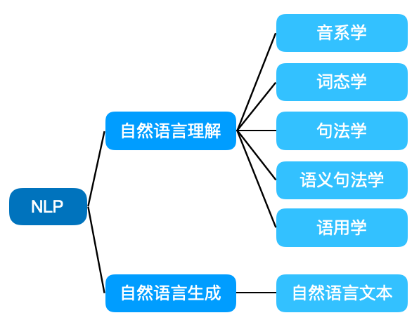

# NLP
## 一、What is NLP?
### NLP的概念
1. NLP （Natural Language Processing）自然语言处理，是人工智能的一个 重要方向，就是研究能实现人与计算机之间用自然语言进行有效通信的各种理论和方法。
2. 从自然语言的角度出发，NLP基本可以分成两个部分：

- 音系学：指代语言中发音的系统化组织。
- 词态学：研究单词构成以及相互之间的关系。
- 句法学：给定文本的哪部分是语法正确的。
- 语义学：给定文本的含义是什么？
- 语用学：文本的目的是什么？[1]
## 二、NLP的研究任务
NLP被应用于很多领域，以下是几种通用的应用：
1. **机器翻译**：计算机具备将一种语言翻译成另外一种语言的能力。
2. **情感分析**：计算机能够判断用户评价是否积极。
	情感分析实用于一些评价网站，如美团、大众点评。可以通过NLP分析总体用户评价是消极还是积极，筛除水军评价。
3. **智能问答**：计算机能够正确回答输入的问题。
	智能回答实用于电商网站。有很多基本而且重复的问题，可以通过智能回答系统来完成。
4. **文摘生成**：计算机能够准确归纳、总结并产生文本摘要。
	文摘生成利用计算机自动地从原始文摘中摘取文献，全面准确地反映某一文献的中心内容，节省时间成本、提高效率。
5. **文本分类**：计算机能够采集各种文章并进行分析，从而进行主题自动分类。
	文本分类是机器对文本按照一定的分类体系自动标注类别的过程。如电子邮箱自动标注垃圾邮件。
6. **知识图谱**：知识点相互连接而成的语义网络。
## 三、NLP的发展历程
1. 萌芽期（1956年以前）
 自然语言处理领域的主流仍然是**基于规则**的理性主义方法。
2. 快速发展期（1980年～1999年）
 基于统计、实例、规则的**语料库**技术蓬勃发展，各种处理技术开始融合。
3. 突飞猛进期（2000年至今）
 Hinton等人研究设计的**深度学习**，提供了强大的学习机制，更好地解决了自然语言处理的难题。

## 参考文献：
[1] 涂铭, 刘祥, 刘树春. Python自然语言处理实战核心技术与算法[M]. 机械工业出版社, 2018.4